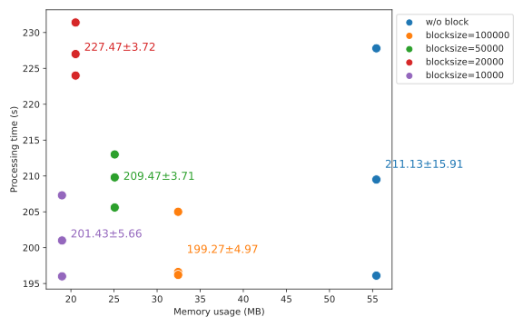

# dbcanLight

A lightweight rewrite of [run_dbcan] for better multithreading performance.
The current version of run_dbcan is using hmmscan, which is reported to be way slow compared to hmmsearch although they're doing the same compute.
It is highly recommended to [use hmmsearch for searching a large sequence database against a profile database][hmmscan_vs_hmmsearch].
To improve the performance and the code readability, [pyhmmer], a Cython bindings to HMMER3, was used instead of the cli HMMER3 suite to run hmmsearch.

In addition to the main script `dbcanlight.py`, another 2 scripts are also included to help parse the hmmsearch outputs.
The `hmmsearch_parser.py` is a rewrite of `hmmscan_parser.py` in `run_dbcan` which can be used to filter the overlapped hits
and convert a domtblout format of hmmsearch into a run_dbcan-10-column format.
The `substrate_parser.py` takes the dbcan-formatted substrate output and map against the [substrate convertion table][dbcansub].

## Usage

Before the first execution, please make sure the [required data](#required_data) have already been downloaded before use.

To test run on the example files, please cd into the folder **example**.

```
cd example
```

A protein fasta file **protein.faa** can be found under the folder.

Run the dbcan cazyme search with 8 cpus:

```
dbcanlight -i protein.faa -m cazyme -t 8
```

By default the output will be directed to stdout. Note that all the logs (below error level) will be suppressed when no output file is specified.

Output to a file by specifying `-o/--output [output directory]`.

```
dbcanlight -i protein.faa -o output -m cazyme -t 8
```

The results will be output to the folder **output** with the basename "**cazymes.tsv**" under `cazyme` mode or "**substrates.tsv**" under `sub` mode.

When searching within a very large sequence database, such as one containing over 1,000,000 sequences,
the keep adding up hits sometimes might exceed the memory limit.
To avoid this issue, dbcanLight performs search with 100,000 sequence per batch by default.
Users are allowed to adjust the block size to fit their own needs.

The example below demonstrates searching with a block containing 10,000 sequences on each iteration,
repeating the process until all the sequences have been processed.

```
dbcanlight -i protein.faa -o output -m cazyme -b 10000 -t 8
```

Please use `dbcanLight --help` to see more details.

### hmmsearch and substrate parser

The script `dbcanLight-hmmparser` can be used to process the domtblout format output came from cli version hmmsearch.
It uses the Biopython SearchIO module to read the hmmer3 domtblout.
If a gene have multiple hits and these hits are overlapped over 50%, only the hit with the lowest evalue will be reported.
The output will be a 10-column tsv. (hmm_name, hmm_length, gene_name, gene_length, evalue, hmm_from, hmm_to, gene_from, gene_to, coverage)

A file **hmmsearch_output** under **example** was from cli hmmsearch with `--domtblout` enabled.
We can filter the results and converted to th 10-column tsv by:

```
dbcanLight-hmmparser -i hmmsearch.out
```

Please use `dbcanLight-hmmparser --help` to see more details.

The script `dbcanLight-subparser` is used to map HMM profiles to its potential substrates.
Note that if your results is in domtblout format, you should first use `dbcanLight-subparser` to convert it into a 10-column tsv.
Use `dbcanLight-subparser --help` to see more details.

## Requirements

- Python >= 3.7
- [Biopython]
- [pyhmmer]

## Install

Use the environment.yml to install all the required packages

```
conda env create -f environment.yml
```

Install the package through pip

```
cd dbcanLight
pip install .
```

<a name="required_data"></a>Please also download the required hmm profile databases and the substrate mapping table with the following cmds:

```
mkdir -p $HOME/.dbcanlight && \
curl -o $HOME/.dbcanlight/substrate_mapping.tsv https://bcb.unl.edu/dbCAN2/download/Databases/fam-substrate-mapping-08252022.tsv && \
curl -o $HOME/.dbcanlight/cazyme.hmm https://bcb.unl.edu/dbCAN2/download/Databases/V12/dbCAN-HMMdb-V12.txt && \
curl -o $HOME/.dbcanlight/substrate.hmm https://bcb.unl.edu/dbCAN2/download/Databases/dbCAN_sub.hmm
```

## Benchmark

The performance test was done on a protein fasta predicted by Prodigal with 9,360 sequences (3.0 MB in size).
3 rounds of test were run on cazyme detection mode (`--tools hmmer` in run_dbcan and `-m cazyme` in dbcanLight) and
substrate detection mode(`--tools dbcansub` in run_dbcan and `-m sub` in dbcanLight).
All tests were run on the same machine with 8 cpus.


The memory usage test was done on a protein fasta predicted by Prodigal with 471,613 sequences. (168 MB in size).
3 rounds of test were done on cazyme detection mode (`-m cazyme` in dbcanLight) with different blocksizes.
All tests were run on the same machine with 8 cpus.
The result shows that process the sequences in batch is able to limit the memory consumption but do not affect the speed.



## Notes

Although hmmscan and hmmsearch are doing the same thing, the results may differ a bit since the evalue would be affected by the size of the database.

[run_dbcan]: https://github.com/linnabrown/run_dbcan
[hmmscan_vs_hmmsearch]: http://cryptogenomicon.org/hmmscan-vs-hmmsearch-speed-the-numerology.html
[pyhmmer]: https://pyhmmer.readthedocs.io/en/stable/index.html
[dbcansub]: http://bcb.unl.edu/dbCAN2/download/Databases/fam-substrate-mapping-08252022.tsv
[Biopython]: https://biopython.org/
