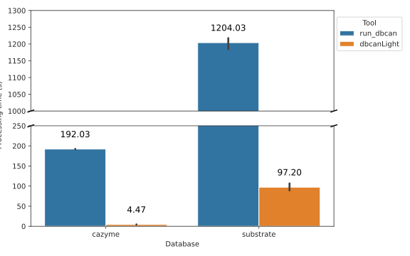
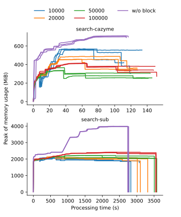

[](https://github.com/chtsai0105/dbcanlight/actions/workflows/build_and_test.yml)
[](https://github.com/chtsai0105/dbcanlight/actions/workflows/build_and_test.yml)
[](https://codecov.io/gh/chtsai0105/dbcanlight)
[](https://github.com/chtsai0105/dbcanlight/blob/main/LICENSE)
[][Bioconda]
[][Bioconda]
[](https://doi.org/10.5281/zenodo.13586881)

# dbcanlight

Dbcanlight is a lightweight rewrite of a widely used CAZyme annotation tool [run_dbcan]. It uses [pyhmmer], a Cython binding to
HMMER3, in place of the HMMER3 CLI suite as the backend for search processes, improving multithreading performance. In addition,
it removes a limitation in run_dbcan that required manual splitting of large sequence files beforehand.

The main program `dbcanlight` comprises three modules - `build`, `search` and `conclude`. The build module help to download the
required databases from dbCAN website; the search module searches against protein HMM, substrate HMM or diamond databases and
reports the hits separately; and the conclude module gathers all the results made by each module and provides a summary.

In addition to the main program, another two programs are also included to help parse the hmmsearch outputs if users have done
their own searches by cli HMMER3 suite. The `dbcanlight-hmmparse` is a rewrite of `hmmscan_parser.py` in run_dbcan which can be
used to filter the overlapped hits and convert a domtblout format file output from hmmer3 suite into a dbCAN-10-column format. The
`dbcanlight-subparser` takes the dbCAN-formatted substrate output and map against the [substrate conversion table][dbcansub].

The output format closely resembles that of run_dbcan, with minor cleanup. For example, run_dbcan may report the same substrate
multiple times for a gene matching several profiles with that substrate, whereas dbcanlight reports it only once.

Dbcanlight only reimplemented the core features of run_dbcan, that is searching for CAZyme and substrate matches by
hmmer/diamond/dbcansub. Submodules like signalP, CGCFinder, etc. are not implemented. If you tend to use these features, please
use the original version of run_dbcan.

## Usage

To test run on the example files, please cd into the folder **example**.

```sh
cd example
```

A protein fasta file **example.faa** can be found under the folder. In additional, there is a domtblout output
**hmmsearch_output**, which is generated from **example.faa** using cli hmmsearch against dbCAN substrate database.

### Build

Build module is used to download the latest databases from dbCAN website and further processes them to certain format that can be
accessed by the search module. In general, there are [4 database files](#setup-folder-for-databases) need to be downloaded first. The raw
database files need further processing - the hmm databases require hmmpress for faster accessibility and diamond database need to
be built from the fasta file. All the processing are done by build module:

```sh
dbcanlight build
```

To ensure the latest databases are obtained, the build modules check the
[database_metadata.json](https://github.com/chtsai0105/dbcanlight/blob/main/database_metadata.json) on the latest main branch,
delete the old database files from the dbcanlight config folder ($HOME/.dbcanlight) and re-download them from the dbCAN website if
database files are missing or outdated. Also note that you can use at most 4 cpus to support parallel downloading.

### Search

Search module contains 3 modes - `cazyme`, `sub` and `diamond`.

Run the dbcan cazyme search with 8 cpus:

```sh
dbcanlight search -i example.faa -m cazyme -t 8
```

The results will be output with the file name "**cazymes.tsv**" under `cazyme` mode, "**substrates.tsv**" under `sub` mode and
"**diamond.tsv**" under `diamond` mode. By default it is output to the current folder (`.`). Users can output to a specific
location by specifying `-o/--output [output directory]`.

```sh
dbcanlight search -i example.faa -o output -m cazyme -t 8
```

All the methods report the predictions with certain threshold. dbcanlight uses 1e-15 for hmm-based analysis (cazyme/sub) and
1e-102 for diamond for the evalue and 0.35 for coverage cutoff, as confirmed empirically in [dbCAN's paper][dbcan2_paper]. Users
can adjust these cutoff by specifying `-e/--evalue` and `-c/--coverage`. Here we run the `diamond` mode with adjusted evalue and
coverage:

```sh
dbcanlight search -i example.faa -o output -m diamond -e 1e-150 -c 0.5 -t 8
```

When searching within a very large sequence database, such as one containing over 1,000,000 sequences, the keep adding up hits
sometimes might exceed the memory limit. To avoid this issue, dbcanlight performs search with 100,000 sequence per batch by
default. Users are allowed to adjust the blocksize to fit their own needs.

The example below demonstrates searching for substrates with a block containing 10,000 sequences on each iteration, repeating the
process until all the sequences have been processed.

```sh
dbcanlight search -i example.faa -o output -m sub -b 10000 -t 8
```

Please use `dbcanlight search --help` to see more details.

### Conclude

After generate all the results by different tools, conclude module can be used to help making an overview table and summarizing
the predictions made by all the tools.

```sh
dbcanlight conclude output
```

Note that you need to have results from at least 2 tools and result files need to be in the same directory. The conclude module
will cast an error if you have only 1 result.

### hmmsearch and substrate parser

The script `dbcanlight-hmmparser` can be used to process the domtblout format output came from cli version hmmsearch. It uses the
Biopython SearchIO module to read the hmmer3 domtblout. If a gene have multiple hits and these hits are overlapped over 50%, only
the hit with the lowest evalue will be reported. The output will be a 10-column tsv. (hmm_name, hmm_length, gene_name,
gene_length, evalue, hmm_from, hmm_to, gene_from, gene_to, coverage)

A file **hmmsearch_output** under **example** was from cli hmmsearch with `--domtblout` enabled. We can filter the results and
converted to the 10-column tsv by:

```sh
dbcanlight-hmmparser -i hmmsearch_output -o hmmsearch_output_parsed.tsv
```

Please use `dbcanlight-hmmparser --help` to see more details.

The script `dbcanlight-subparser` is used to map HMM profiles to its potential substrates.

```sh
dbcanlight-hmmparser -i hmmsearch_output_parsed.tsv -o substrate_from_hmmsearch_output.tsv
```

Use `dbcanlight-subparser --help` to see more details.

## Requirements

- [Python] >= 3.9
- [Biopython]
- [pyhmmer], a HMMER3 implementation on python3.
- [urllib3](https://urllib3.readthedocs.io/en/stable/), a powerful HTTP client for Python.

## Install

### through Conda (recommended)

The most easiest way to install dbcanlight is through Conda.

```sh
conda install bioconda::dbcanlight
```

### from latest stable release

Alternatively, you can download the source code from the [latest stable
release](https://github.com/chtsai0105/dbcanlight/releases/latest) and decompress it.

Go into the dbcanlight folder and install the package through pip.

```sh
cd dbcanlight-1.X.X
pip install .
```

### git clone the project

You can also directly `git clone` the main or other branches.

ssh
```sh
git clone git@github.com:chtsai0105/dbcanlight.git
```

or https
```sh
git clone https://github.com/chtsai0105/dbcanlight.git
```

Note that the source code on main and other branches may still under development. Please use it cautiously.

### Setup folder for databases

By default, dbcanlight creates a `.dbcanlight` folder under users' home directory to save required database files on the first
launch. To avoid cluttering the home directory, you can use symlink or assign a different location by setting the `$DBCANLIGHT_DB`
environment variable.

```sh
export DBCANLIGHT_DB=/path/user/dbcanlight_db
```

If you installed dbcanlight through Conda, please refer to [this section in Conda
documentation](https://docs.conda.io/projects/conda/en/latest/user-guide/tasks/manage-environments.html#setting-environment-variables)
to see how to set environment variables during activating a Conda environment.

The path can be read-only if you only intend to use but not update the databases. (e.g a shared database folder provided by system
admin) However, dbcanlight build requires the path to be writable by the user and will raise an error if it is not.

Four database files need to be downloaded prior the analysis. You can download them with [the build module](#build) or manually by
the following commands:

```sh
mkdir $HOME/.dbcanlight
curl -o $HOME/.dbcanlight/cazyme.hmm https://bcb.unl.edu/dbCAN2/download/Databases/V13/dbCAN-HMMdb-V13.txt && \
curl -o $HOME/.dbcanlight/substrate.hmm https://bcb.unl.edu/dbCAN2/download/Databases/dbCAN_sub.hmm && \
curl -o $HOME/.dbcanlight/substrate_mapping.tsv https://bcb.unl.edu/dbCAN2/download/Databases/fam-substrate-mapping-08012023.tsv && \
curl -o $HOME/.dbcanlight/cazydb.fa https://bcb.unl.edu/dbCAN2/download/Databases/V13/CAZyDB.07142024.fa
```

Hmmpress the plain hmm file for faster accessibility:

```sh
hmmpress $HOME/.dbcanlight/cazyme.hmm
hmmpress $HOME/.dbcanlight/substrate.hmm
```

Next, build the diamond database by the following cmd:

```sh
diamond makedb --in ~/.dbcanlight/cazydb.fa --db ~/.dbcanlight/cazydb.dmnd -t 4
```

### Install additional packages for developing (developer only)

Developer should clone the GitHub project directly instead of downloading from the releases. Some of the files for developing
purpose only are not included in the releases.

In addition to the requirements listed above, we use the package [pre-commit] for code formatting. Developer can install it
through Conda by:

```sh
conda install pre-commit>=3.4.0
```

For convenience we also provide the additional Conda env file. Please use the dev_additional_packages.yml to install the additional packages.

```sh
conda env update -f dev_additional_packages.yml
```

Go into the dbcanlight folder and set up the git hook scripts.

```sh
cd dbcanlight
pre-commit install
```

## Benchmark

The protein fasta from Fusarium falciforme genome assembly [ASM2687354v1] (RefSeq: [GCF_026873545.1]), which contains 14,574 sequences
(8.1 MB in size) was used for performance and multithreading test. 3 rounds of test were run on cazyme and substrate detection
mode (`--tools hmmer dbcansub` in run_dbcan and `-m cazyme` and `-m sub` in dbcanlight). The performance tests were all run on the
same machine with 8 cpus and 48 GB pre-allocated RAM and the multithreading tests were run on 1, 2, 4, 8 and 16 cpus with 32 GB
pre-allocated RAM. Both run with default blocksize (100,000). The performance tests show that the dbcanlight is approximately 3X
faster than run_dbcan with acceptable 2 GB of RAM usage. The multithreading tests show that 4 or 8 cpus might be the most
efficient configuration since the RAM usage is growing dramatically when using more than 8 cpus but doesn't speed up that much
anymore.




In order to get more details on RAM usage, we used another larger protein fasta downloaded from JGI (project ID: [Gp0071737]; IMG
data: 43891.assembled.faa can be downloaded from [JGI data portal][JGI_data_portal]), which contains 388,021 sequences (59 MB in
size). 3 rounds of test were run on cazyme and substrate detection mode (`-m cazyme` and `-m sub` in dbcanlight) with different
blocksizes. All tests were run on the same machine with 8 cpus and 48 GB pre-allocated RAM. The result shows that process the
sequences in batch is able to limit the memory consumption but do not affect the speed too much when blocksize is set as 10,000.



## Reference

When using dbcanlight in your research, please cite it as described in [here](CITATION.cff). Please also cite the original dbCAN
publications, as dbcanlight is built upon the [run_dbcan] tool and the databases curated by the dbCAN team:

> Jinfang Zheng, Qiwei Ge, Yuchen Yan, Xinpeng Zhang, Le Huang, Yanbin Yin, dbCAN3: automated carbohydrate-active enzyme and substrate annotation, Nucleic Acids Research, Volume 51, Issue W1, 5 July 2023, Pages W115–W121, https://doi.org/10.1093/nar/gkad328

> Han Zhang, Tanner Yohe, Le Huang, Sarah Entwistle, Peizhi Wu, Zhenglu Yang, Peter K Busk, Ying Xu, Yanbin Yin, dbCAN2: a meta server for automated carbohydrate-active enzyme annotation, Nucleic Acids Research, Volume 46, Issue W1, 2 July 2018, Pages W95–W101, https://doi.org/10.1093/nar/gky418

[Bioconda]: https://anaconda.org/bioconda/dbcanlight
[Biopython]: https://biopython.org/
[dbcan2_paper]: https://doi.org/10.1093/nar/gky418
[dbcansub]: http://bcb.unl.edu/dbCAN2/download/Databases/fam-substrate-mapping-08252022.tsv
[hmmscan_vs_hmmsearch]: http://cryptogenomicon.org/hmmscan-vs-hmmsearch-speed-the-numerology.html
[pre-commit]: https://pre-commit.com/
[pyhmmer]: https://pyhmmer.readthedocs.io/en/stable/index.html
[pytest]: https://docs.pytest.org/en/stable/
[pytest-cov]: https://pytest-cov.readthedocs.io/en/stable/
[python]: https://www.python.org/
[run_dbcan]: https://github.com/linnabrown/run_dbcan
[ASM2687354v1]: https://www.ncbi.nlm.nih.gov/datasets/genome/GCF_026873545.1/
[GCF_026873545.1]: https://ftp.ncbi.nlm.nih.gov/genomes/all/GCF/026/873/545/GCF_026873545.1_ASM2687354v1/
[Gp0071737]: https://gold.jgi.doe.gov/project?id=Gp0071737
[JGI_data_portal]: https://files.jgi.doe.gov/search/?q=Grassland+Soil+Metagenome+09_27_2013_1_40cm
