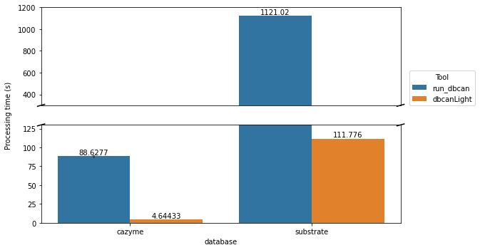

# dbcanLight
A lightweight rewrite of [run_dbcan] for better multithreading performance.
The current version of run_dbcan is using hmmscan, which is reported to be way slow compared to hmmsearch although they're doing the same compute.
It is highly recommended to [use hmmsearch for searching a large sequence database against a profile database][hmmscan_vs_hmmsearch].
To improve the performance and the code readability, [pyhmmer], a HMMER3 implementation on python3, was used instead of the cli HMMER3 suite to run hmmsearch.

In addition to the main script `dbcanlight.py`, I also provide another 2 scripts to help parse the hmmsearch outputs.
The `hmmsearch_parser.py` is a rewrite of `hmmscan_parser.py` in `run_dbcan` which can be used to filter the overlapped hits
and convert the domtblout format of hmmsearch into the run_dbcan-10-column format.
The `substrate_parser.py` takes the dbcan-formatted substrate output and map against the [substrate convertion table][dbcansub].

## Benchmark
Test on a protein.faa predicted by Prodigal with 9,360 sequences.
3 rounds of test have run on cazyme detection (`--tools hmmer` in run_dbcan and `-m cazyme` in dbcanLight).
1 round of test have run on substrate detection (`--tools dbcansub` in run_dbcan and `-m sub` in dbcanLight).
All tests are run on the same machine with 8 cpus.



## Usage
Please make sure the [required data](#required_data) have already been downloaded before use.

Use `dbcanlight --help` to see more details.
```
options:
  -h, --help            show this help message and exit
  -i INPUT, --input INPUT
                        Plain or gzipped protein fasta
  -o OUTPUT, --output OUTPUT
                        Output directory (default=stdout)
  -m {cazyme,sub}, --mode {cazyme,sub}
                        Search against cazyme or substrate database
  -e EVALUE, --evalue EVALUE
                        Reporting evalue cutoff (default=1e-15)
  -c COVERAGE, --coverage COVERAGE
                        Reporting coverage cutoff (default=0.35)
  -t THREADS, --threads THREADS
                        Total number of cpus allowed to use
  -b BLOCKSIZE, --blocksize BLOCKSIZE
                        Number of sequences to search per round. Lower the block size to use fewer memory
  -v, --verbose         Verbose mode for debug
  -V, --version         show program's version number and exit
```

Say we have a protein fasta file **protein.faa**. Run the dbcan cazyme search with 8 cpus:
```
dbcanlight -i protein.faa -m cazyme -t 8
```
By default the output will direct to stdout. Note that all the logs (below error level) will be suppressed.

Output to file by specifying `-o/--output [output directory]`.
```
dbcanlight -i protein.faa -o output -m cazyme -t 8
```
The filename will be "**cazymes.tsv**" with `cazyme` mode and "**substrates.tsv**" with `sub` mode.

When searching within a very large sequence database, such as one containing over 1,000,000 sequences,
it's challenging to predict the number of hits in advance, making it easy to exceed memory limits.
dbcanLight offers a solution by allowing users to perform searches using split sequence blocks, effectively avoiding memory limitations.

The example below demonstrates searching within a sequence block containing 10,000 sequences during each iteration,
repeating the process until all the sequences have been processed.
```
dbcanlight -i protein.faa -o output -m cazyme -b 10000 -t 8
```

### hmmsearch and substrate parser
The script `dbcanLight-hmmparser` can be used to process the domtblout format output from cli version hmmsearch.
It uses the Biopython SearchIO module to read the hmmer3 domtblout.
If a gene have multiple hits and these hits are overlapped over 50%, only the hit with the lowest evalue will be reported.
The output will be a 10-column tsv. (hmm_name, hmm_length, gene_name, gene_length, evalue, hmm_from, hmm_to, gene_from, gene_to, coverage)

Use `dbcanLight-hmmparser --help` to see more details.
```
options:
  -h, --help            show this help message and exit
  -i INPUT, --input INPUT
                        CAZyme searching output in dbcan or hmmsearch format
  -o OUTPUT, --output OUTPUT
                        Output file path (default=stdout)
  -e EVALUE, --evalue EVALUE
                        Reporting evalue cutoff (default=1e-15)
  -c COVERAGE, --coverage COVERAGE
                        Reporting coverage cutoff (default=0.35)
  -v, --verbose         Verbose mode for debug
```

Say we have a file **hmmsearch.out** that come from hmmsearch with `--domtblout` enabled.
We can filter the results by:
```
python3 hmmsearch_parser.py -i hmmsearch.out
```

The script `dbcanLight-subparser` is used to map HMM profiles to its potential substrates.
Note that if your results is in domtblout format, you should first use `dbcanLight-subparser` to convert it to a 10-column tsv.
Use `dbcanLight-subparser --help` to see more details.
```
options:
  -h, --help            show this help message and exit
  -i INPUT, --input INPUT
                        dbcan-sub searching output in dbcan format
  -o OUTPUT, --output OUTPUT
                        Output file path (default=stdout)
  -v, --verbose         Verbose mode for debug
```

## Requirements
- Python >= 3.7
- [Biopython]
- [pyhmmer]

Use the environment.yml to install all the required packages
```
conda env create -f environment.yml
```

Install the package through pip
```
cd dbcanLight
pip install .
```

<a name="required_data"></a>Please also download the required hmm profile databases and the substrate mapping table with the following cmds:
```
mkdir -p $HOME/.dbcanlight && \
curl -o $HOME/.dbcanlight/substrate_mapping.tsv https://bcb.unl.edu/dbCAN2/download/Databases/fam-substrate-mapping-08252022.tsv && \
curl -o $HOME/.dbcanlight/cazyme.hmm https://bcb.unl.edu/dbCAN2/download/Databases/V11/dbCAN-HMMdb-V11.txt && \
curl -o $HOME/.dbcanlight/substrate.hmm https://bcb.unl.edu/dbCAN2/download/Databases/dbCAN_sub.hmm
```

## Notes
Although the hmmscan and hmmsearch are doing the same thing, the results may differ a bit since the evalue would be affected by the size of the database.

[run_dbcan]: https://github.com/linnabrown/run_dbcan
[hmmscan_vs_hmmsearch]: http://cryptogenomicon.org/hmmscan-vs-hmmsearch-speed-the-numerology.html
[pyhmmer]: https://pyhmmer.readthedocs.io/en/stable/index.html
[dbcansub]: http://bcb.unl.edu/dbCAN2/download/Databases/fam-substrate-mapping-08252022.tsv
[Biopython]: https://biopython.org/