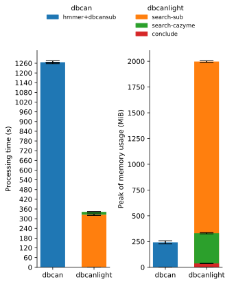
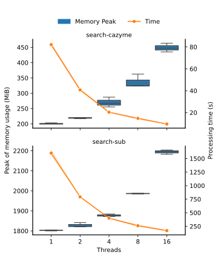

[](https://github.com/chtsai0105/dbcanlight/actions/workflows/build_and_test.yml)
[][Bioconda]
[](https://github.com/chtsai0105/dbcanlight/actions/workflows/build_and_test.yml)
[](https://codecov.io/gh/chtsai0105/dbcanlight)
[](https://github.com/chtsai0105/dbcanlight/blob/main/CHANGELOG.md)
[](https://github.com/chtsai0105/dbcanlight/blob/main/LICENSE)
[](https://doi.org/10.5281/zenodo.13586882)

# dbcanlight

A lightweight rewrite of [run_dbcan] for better multithreading performance. The previous version of run_dbcan uses hmmscan, which
is reported to be way slow compared to hmmsearch although they're doing the same compute. It is highly recommended to [use
hmmsearch for searching a large sequence database against a profile database][hmmscan_vs_hmmsearch] and in the latest update
[run_dbcan] finally switch to use hmmsearch. To further improve the performance and the code readability, [pyhmmer], a Cython
bindings to HMMER3, was used to instead the cli version of HMMER3 for hmmsearch processes.

My implementation also address another issue in the original [run_dbcan] that the input contains over million of sequences need to
be split beforehand. In dbcanlight, inputs are able to be processed in batch so no need for manual file splitting.

The main program `dbcanlight` comprises 3 modules - `build`, `search` and `conclude`. The build module help to download the
required databases from dbcan website; the search module searches against protein HMM, substrate HMM or diamond databases and
reports the hits separately; and the conclude module gathers all the results made by each module and provides a brief overview.

In addition to the main program, another 2 programs are also included to help parse the hmmsearch outputs if users have done their
own searches by cli HMMER3 suite. The `dbcanlight-hmmparse` is a rewrite of `hmmscan_parser.py` in `run_dbcan` which can be used
to filter the overlapped hits and convert a domtblout format file output from hmmer3 suite into a dbcan-10-column format. The
`dbcanlight-subparser` takes the dbcan-formatted substrate output and map against the [substrate conversion table][dbcansub].

The output of dbcanlight is resemble to the original [run_dbcan] with slight cleanup. The original [run_dbcan] output the same
substrate several times for a gene that hits multiple profiles with the same substrate; in dbcanlight we only report it once.

Dbcanlight only re-implemented the core features of [run_dbcan], that is searching for CAZyme and substrate matches by
hmmer/diamond/dbcansub. Submodules like signalP, CGCFinder, etc. are not implemented. If you tend to use these features, please
use the original version of [run_dbcan].

## Usage

To test run on the example files, please cd into the folder **example**.

```
cd example
```

A protein fasta file **example.faa** can be found under the folder. In additional, there is a domtblout output
**hmmsearch_output**, which is generated from **example.faa** using cli hmmsearch against dbcan substrate database.

### Build

Build module is used to download the latest databases from dbcan website and further processes them to certain format that can be
accessed by the search module. In general, there are [4 database files](#required_data) need to be downloaded first. The raw
database files need further processing - the hmm databases require hmmpress for faster accessibility and diamond database need to
be built from the fasta file. All the processing are done by build module:

```
dbcanlight build
```

To ensure the latest databases are obtained, the build module will delete the old database files from the dbcanlight config folder
($HOME/.dbcanlight) and re-download from the dbcan website every time it runs. Also note that you can use at most 4 cpus to
support parallel downloading.

### Search

Search module contains 3 modes - `cazyme`, `sub` and `diamond`.

Run the dbcan cazyme search with 8 cpus:

```
dbcanlight search -i example.faa -m cazyme -t 8
```

The results will be output with the file name "**cazymes.tsv**" under `cazyme` mode, "**substrates.tsv**" under `sub` mode and
"**diamond.tsv**" under `diamond` mode. By default it is output to the current folder (`.`). Users can output to a specific
location by specifying `-o/--output [output directory]`.

```
dbcanlight search -i example.faa -o output -m cazyme -t 8
```

All the methods report the predictions with certain threshold. dbcanlight uses 1e-15 for hmm-based analysis (cazyme/sub) and
1e-102 for diamond for the evalue and 0.35 for coverage cutoff, as confirmed empirically in [dbcan's paper][dbcan2_paper]. Users
can adjust these cutoff by specifying `-e/--evalue` and `-c/--coverage`. Here we run the `diamond` mode with adjusted evalue and
coverage:

```
dbcanlight search -i example.faa -o output -m diamond -e 1e-150 -c 0.5 -t 8
```

When searching within a very large sequence database, such as one containing over 1,000,000 sequences, the keep adding up hits
sometimes might exceed the memory limit. To avoid this issue, dbcanlight performs search with 100,000 sequence per batch by
default. Users are allowed to adjust the blocksize to fit their own needs.

The example below demonstrates searching for substrates with a block containing 10,000 sequences on each iteration, repeating the
process until all the sequences have been processed.

```
dbcanlight search -i example.faa -o output -m sub -b 10000 -t 8
```

Please use `dbcanlight search --help` to see more details.

### Conclude

After generate all the results by different tools, conclude module can be used to help making an overview table and summarizing
the predictions made by all the tools.

```
dbcanlight conclude output
```

Note that you need to have results from at least 2 tools. The conclude module will cast an error if you have only 1 results.

### hmmsearch and substrate parser

The script `dbcanlight-hmmparser` can be used to process the domtblout format output came from cli version hmmsearch. It uses the
Biopython SearchIO module to read the hmmer3 domtblout. If a gene have multiple hits and these hits are overlapped over 50%, only
the hit with the lowest evalue will be reported. The output will be a 10-column tsv. (hmm_name, hmm_length, gene_name,
gene_length, evalue, hmm_from, hmm_to, gene_from, gene_to, coverage)

A file **hmmsearch_output** under **example** was from cli hmmsearch with `--domtblout` enabled. We can filter the results and
converted to the 10-column tsv by:

```
dbcanlight-hmmparser -i hmmsearch_output -o hmmsearch_output_parsed.tsv
```

Please use `dbcanlight-hmmparser --help` to see more details.

The script `dbcanlight-subparser` is used to map HMM profiles to its potential substrates.

```
dbcanlight-hmmparser -i hmmsearch_output_parsed.tsv -o substrate_from_hmmsearch_output.tsv
```

Use `dbcanlight-subparser --help` to see more details.

## Requirements

- [Python] >= 3.7
- [Biopython] >= 1.81
- [pyhmmer] >= 0.10.4

## Install

dbcanlight is available on [Bioconda], you can install it through:

```
conda install -c bioconda dbcanlight
```

Note that the bioconda dependencies require python to be >= 3.9 when installing via conda.

Alternatively, you can build from the source code. Download the source code from the [latest
release](https://github.com/chtsai0105/dbcanlight/releases/latest) and decompress it. To avoid messing around the base
environment, try to create a conda/virturl env and install it inside it.

Install the package through pip

```
cd [decompressed source dir]
pip install .
```

<a name="required_data"></a>Four database files need to be downloaded prior the analysis. You can download them with [the build
module](#build) or manually by the following commands:

```
mkdir $HOME/.dbcanlight
curl -o $HOME/.dbcanlight/cazyme.hmm https://bcb.unl.edu/dbCAN2/download/Databases/V12/dbCAN-HMMdb-V12.txt && \
curl -o $HOME/.dbcanlight/substrate.hmm https://bcb.unl.edu/dbCAN2/download/Databases/dbCAN_sub.hmm
curl -o $HOME/.dbcanlight/substrate_mapping.tsv https://bcb.unl.edu/dbCAN2/download/Databases/fam-substrate-mapping-08252022.tsv && \
curl -o $HOME/.dbcanlight/cazydb.fa https://bcb.unl.edu/dbCAN2/download/Databases/CAZyDB.07262023.fa
```

Next, build the diamond database by the following cmd:

```
diamond makedb --in ~/.dbcanlight/cazydb.fa --db ~/.dbcanlight/cazydb.dmnd -t 4
```

### Install additional package for developing (developer only)

Developer should clone the GitHub project directly instead of downloading from the releases. Some of the files for developing
purpose only are not included in the releases.

In addition to the requirements listed above, the following packages are required for developing environment.

- [pre-commit] >= 3.4.0
- [pytest] >= 8.0.0
- [pytest-cov] >= 5.0.0

Developer can install it with conda by:

```
conda install pre-commit>=3.4.0 pytest>=8.0.0 pytest-cov>=5.0.0
```

For convenience we also provide the additional conda env file. Please use the `dev_additional_packages.yml` to install the
additional packages.

```
conda env update -f dev_additional_packages.yml
```

Lastly, activate the environment and install the pre-commit hook to the repo:

```
conda activate dbcanlight
pre-commit install
```

## Benchmark


The protein fasta from Fusarium falciforme genome assembly [ASM2687354v1] (RefSeq: [GCF_026873545.1]), which contains 14,574 sequences
(8.1 MB in size) was used for performance and multithreading test. 3 rounds of test were run on cazyme and substrate detection
mode (`--tools hmmer dbcansub` in run_dbcan and `-m cazyme` and `-m sub` in dbcanlight). The performance tests were all run on the
same machine with 8 cpus and 48 GB pre-allocated RAM and the multithreading tests were run on 1, 2, 4, 8 and 16 cpus with 32 GB
pre-allocated RAM. Both run with default blocksize (100,000). The performance tests show that the dbcanlight is approximately 3X
faster than run_dbcan with acceptable 2 GB of RAM usage. The multithreading tests show that 4 or 8 cpus might be the most
efficient configuration since the RAM usage is growing dramatically when using more than 8 cpus but doesn't speed up that much
anymore.





In order to get more details on RAM usage, we used another larger protein fasta downloaded from JGI (project ID: [Gp0071737]; IMG
data: 43891.assembled.faa can be downloaded from [JGI data portal][JGI_data_portal]), which contains 388,021 sequences (59 MB in
size). 3 rounds of test were run on cazyme and substrate detection mode (`-m cazyme` and `-m sub` in dbcanlight) with different
blocksizes. All tests were run on the same machine with 8 cpus and 48 GB pre-allocated RAM. The result shows that process the
sequences in batch is able to limit the memory consumption but do not affect the speed too much when blocksize is set as 10,000.


[Bioconda]: https://anaconda.org/bioconda/dbcanlight
[Biopython]: https://biopython.org/
[dbcan2_paper]: https://doi.org/10.1093/nar/gky418
[dbcansub]: http://bcb.unl.edu/dbCAN2/download/Databases/fam-substrate-mapping-08252022.tsv
[hmmscan_vs_hmmsearch]: http://cryptogenomicon.org/hmmscan-vs-hmmsearch-speed-the-numerology.html
[pre-commit]: https://pre-commit.com/
[pyhmmer]: https://pyhmmer.readthedocs.io/en/stable/index.html
[pytest]: https://docs.pytest.org/en/stable/
[pytest-cov]: https://pytest-cov.readthedocs.io/en/stable/
[python]: https://www.python.org/
[run_dbcan]: https://github.com/linnabrown/run_dbcan
[ASM2687354v1]: https://www.ncbi.nlm.nih.gov/datasets/genome/GCF_026873545.1/
[GCF_026873545.1]: https://ftp.ncbi.nlm.nih.gov/genomes/all/GCF/026/873/545/GCF_026873545.1_ASM2687354v1/
[Gp0071737]: https://gold.jgi.doe.gov/project?id=Gp0071737
[JGI_data_portal]: https://files.jgi.doe.gov/search/?q=Grassland+Soil+Metagenome+09_27_2013_1_40cm
